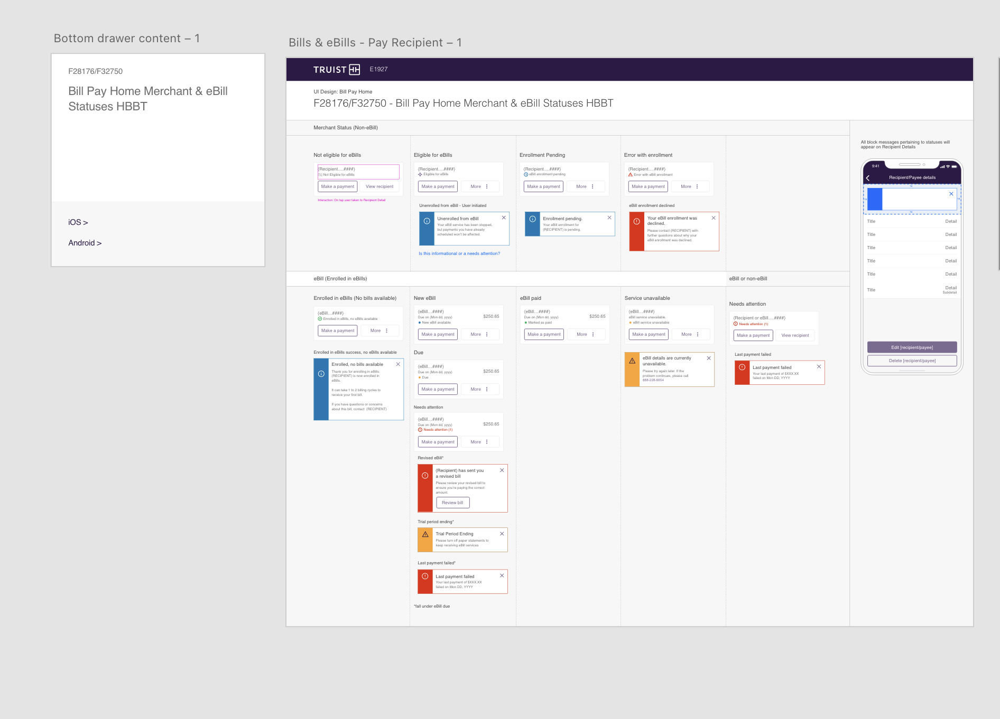

### What

- I was hired as a Senior UI Designer to support the redesign SunTrust's commercial banking mobile app; specifically the payments and transfers feature on Android and iOS.

### Why

- To **redesign** the SunTrust app to relaunch under the Truist design system by 2021 under aggressive feature delivery deadlines.
- To **assess, lift and shift** components from SunTrust—and BB&T—commercial mobile banking without losing functionality post-merger.

### How
- Designed a mobile-first responsive UI interface for +200 payments and transfer screens, specifically addressing slight content variations between BB&T and SunTrust, for commercial banking's app relaunch on Android and iOS.
- Maintained a decision log posted weekly to Slack after recognizing the challenges facing the team in tracking frequent, often cascading, change to the enterprise design system.
- The log enabled the team to centralize knowledge, make recommendations and improve delivery tracking.

